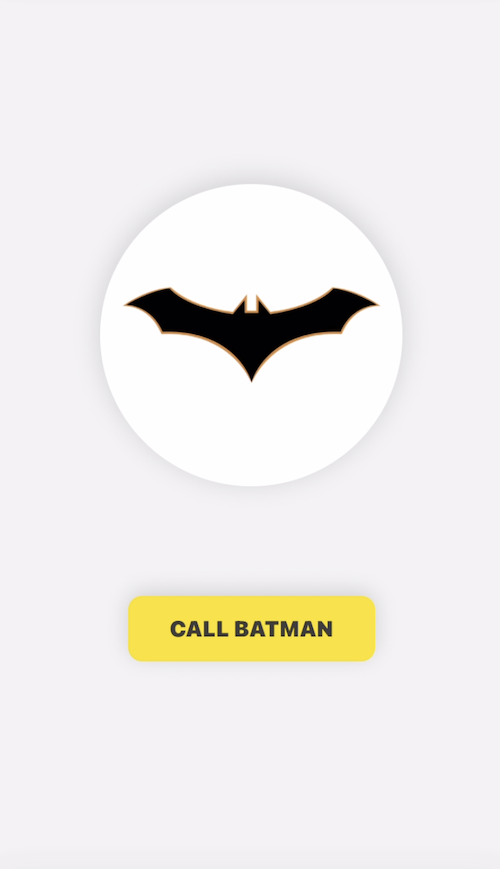
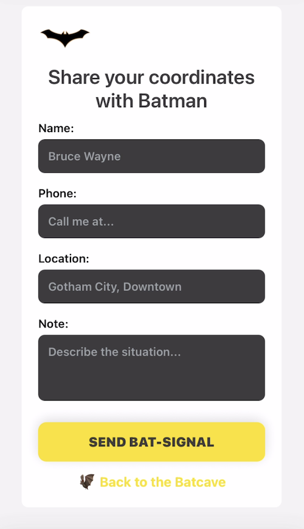

# 🦇 Bat-Signal App  

> “When Gotham is in trouble, just light the sky.”  

Are you ready to call Batman? Because he's coming... The **Bat-Signal App** is a playful mobile project built with React Native + TypeScript. It simulates the iconic Bat-Signal: users can activate the signal and fill out a form to share their coordinates with Batman.

## About the Project

This project was created as part of the **Mobile Developer Bootcamp** by [DIO](https://www.dio.me), guided by professor Felipão, designed by me, and inspired by the Dark Knight universe. 

## 📱 Features  

### Home Screen
- Displays the Bat logo.
- Animated button to activate the Bat-Signal.

### Form Screen
- The Bat logo (small version) remains at the top as a stamp.
- A themed prompt: “Share your coordinates with Batman”.
- Input fields: Name, Phone, Location, and Note.
- Button to send the Bat-Signal with a custom alert.
- Option to return: “🦇 Back to the Batcave”.

### Animations
- Logo fades in.
- Button slides up.
- Form fades in/out when switching screens.

## 🎨 Preview  

Here’s a glimpse of the Bat-Signal App layout:  

| Home | Form | 
|:----------:|:----------:|
|  |  |

## ⚖️ Techn Stack

- [React Native](https://reactnative.dev/)  
- [TypeScript](https://www.typescriptlang.org/)  
- [Expo](https://expo.dev/)  
- [React Native Animated API](https://reactnative.dev/docs/animated)  

## 📂 Basic Structure

```text
Bat-Signal-App/
 ┣ 📂 src/
 ┃ ┣ 📂 assets/       # Bat logo, prints, icons
 ┃ ┣ 📂 components/   # Reusable UI elements
 ┃ ┣ 📂 hooks/        # Custom hooks (animations)
 ┃ ┣ 📂 screens/      # Main app screens
 ┃ ┣ 📂 styles/       # Theme style (global)
 ┣ App.tsx            # Entry point
 ┣ package.json
 ┗ tsconfig.json
```

## 👊🏻 How to Run Locally  

Follow the Bat-signal to set it up on your machine:  

```bash
# 1. Clone the repository
git clone https://github.com/naty-c/Bat-Signal-Mobile-App

# 2. Go to project folder
cd Bat-Signal--Mobile-App

# 3. Install dependencies
npm install 

# 4. Run the app & Have fun :)
npm run start
```

💡 **Tip:** Use VSCode **R Component** extension for a more productive Batcave setup + **Expo** or **Android Studio** for tests.

## 🌟✨ Roadmap 

- [ ] React Navigation
- [ ] Input validation
- [ ] Dark mode support
- [ ] Custom Gotham fonts (inspired at least)
- [ ] Integration with backend (Bat-Database 🗂️)
- [ ] Map view for user location
